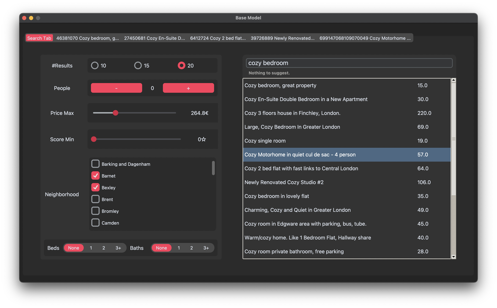
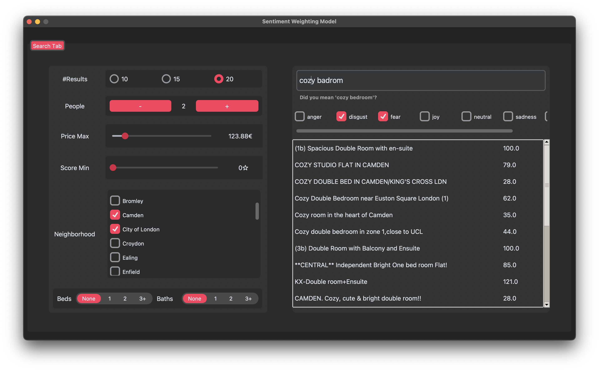
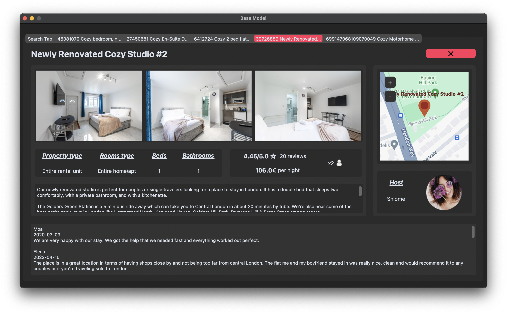

# London Accommodations Search-Engine

## Installation

Download the repository:  
```
git clone https://github.com/albertonuzzaci/ProgettoGestione.git
```  
In the main directory uncompress the dataset in order to have: 
```
mainDir/dataset/json/
mainDir/dataset/information.json
mainDir/dataset/reviews.pickle
```

It is advised to download used libraries in a virtual environment.
```
python -m venv venv
source activate
```
It may change depending on the operating system.

Install dependecies (be aware to be in the virtual environment directory):  
```
pip install -r requirements.txt
```  

## Usage
Run the search engine
```
python main.py [-h] [--build-index] [-B | -S | -RS | -D2V]
```  

Options: 
* ```-h, --help``` show an help message and exit. 
* ```--build-index``` build again the index. 
* ```[-B | -S | -RS | -D2V]``` choose the weighting model to run. 
	* ```-B``` run the search engine using the ```BM25F``` weighting model. This model is the default used in ```whoosh```. Without any option it will be taken as the **default** model. 
	* ```-S``` run the search engine using the ```SentimentModelWA``` weighting model. During the search a user can sort the results based on the feelings searched for. 
	* ```-RS```run the search engine using the ```SentimentModelARWA``` weighting model. During the search a user can sort the results based on the feelings searched for and at the same time on the amount of reviews.
	* ```-D2V``` run the search engine using the ```Doc2VecModel``` weighting model. It use *doc2vec* which is a technique for generating vector representations of documents, allowing for efficient comparison and analysis of their semantic meanings.

Running requires
* **Index**: highly optimized data structure that contains indexed documents and their associated information, enabling fast and efficient text search and data analysis.
* **Reviews file**: file used in model that enable ranking by sentiment. 
* **Doc2Vec model** and **vector in a json file**: file used by  ```Doc2VecModel```.

If It's the first time you run this project, all the needed file will be generated. However, this could take a long time.
Therefore, a pre-built version of every file is provided so, if everything downloaded correctly, the project should starts istantly. 

**Please note that an error related to the searcher object may occur. In that case try to build again index running:** 
```
python main.py [-B | -S | -RS | -D2V] --build-index
```

## Project Structure

* ***assets***: directory containing images for graphic interface. 
* ***dataset***: the dataset. 
* ***doc2vec***: this package contains the implementation of ```Doc2VecModel```
* ***evaluation***: this package contains functions and queries for *benchmarks.ipynb*.
* ***gui***: this package contains the GUI code. 
* ***indexdir***: directory containing the index. 
* ***sentiment***: this package contains the implementation of ```SentimentModelARWA``` and ```SentimentModelWA```
* ***benchmarks.ipynb***: notebook to run benchmarks
* ***controller\.py***: file serves as the central hub for interacting with and orchestrating the functionalities of various other files within a software project. 
* ***index\.py***: this file builds setup the *schema* and then build the *index* which is stored in the *indexdir* directory. 
* ***main\.py***: run the program. 
* ***model\.py***: carry out the actual search function after having appropriately selected the model.
* ***config\.py***: stores configuration settings and parameters for the search-engine. 


## Query Language

All the version of the search-engine support **Natuarl Query Language**. Additionaly, when ```SentimentModelARWA``` rather than ```SentimentModelWA``` are launched a list of convenient *Sentiments* checkboxes will appear. Through this series of checkboxes an user can rank retrived documents based on *Sentiments* selected. 

Furthermore, all the versions of the search-engine provide the following filters to the user in order to better personalize the search experience:
* *#NResult* using this button It's possible to decrease and increase the number of the retrieved documents. 
* *People* using this button It's possible to decrease and increase the number of people the accommodation must be able to accommodate.
* *Price Max* through this scrollbar user can require accomodations specifying a maximum price
* *Score Min* through this scrollbar user can require accomodations specifying a minimum score (not related to sentiment)
* *Neighborhood* thorugh this series of checkboxes users can specify in which neighborhood is looking for an accomodation. 
* *Beds* and *Baths* both the buttons allow users to specify how many beds and baths they need. 

Moreover, It's also present slightly above the search-box a *"did you mean ... ?"* button in order to suggest to  users a possible correction about the formulated query. By a simple click on text in the search-box will be changed. 


## GUI
The GUI is the front-end of the search engine. The main views present follow. 

This is the main view for the models ```Doc2VecModel``` and ```BM25F``` (without sentiments). 



Instead, this is the main view for the models ```SentimentModelARWA``` and ```SentimentModelWA``` (with sentiments). It's possible to see also  ```did you mean '...'?``` tool. 


When an accomodation is clicked this will be the view shown.


## Dataset

- **id**: The unique identifier for the listing.
- **listing_url**: The URL link to the Airbnb listing page.
- **name**: The title of the listing.
- **description**: A detailed description of the property, including amenities and location information.
- **host_name**: The name of the host offering the property.
- **host_id**: The unique identifier for the host.
- **host_url**: The URL link to the host's Airbnb profile page.
- **host_picture_url**: The URL link to the host's profile picture.
- **neighbourhood_cleansed**: The specific neighborhood where the property is located.
- **latitude** and **longitude** : The geographical latitude and longitude coordinate of the property (used for map tool).
- **property_type**: The type of property being offered (e.g., apartment, house, etc.).
- **room_type**: The type of room being offered (e.g., entire place, private room, shared room).
- **accommodates**: The number of guests the property can accommodate.
- **bathrooms**: The number of bathrooms available to guests.
- **beds**: The number of beds available to guests.
- **price**: The nightly price for the property.
- **numbers_of_review**: The total number of reviews the listing has received.
- **review_scores_rating**: The overall rating score of the listing based on reviews.
- **reviews**: A list of individual reviews left by guests, each including the reviewer's name, date of review, and the review text.

The dataset was built from the data available on [Inside Airbnb](https://insideairbnb.com/get-the-data/) in the London section by using the `listing.csv` and `reviews.csv` files. After appropriate operations, these files were merged and transformed into approximately 39,000 JSON files.

Accommodations with null (or NaN) values and those without reviews were removed.

## Authors
* Alberto Nuzzaci
* Luca Lodesani
* Riccardo Neri 
